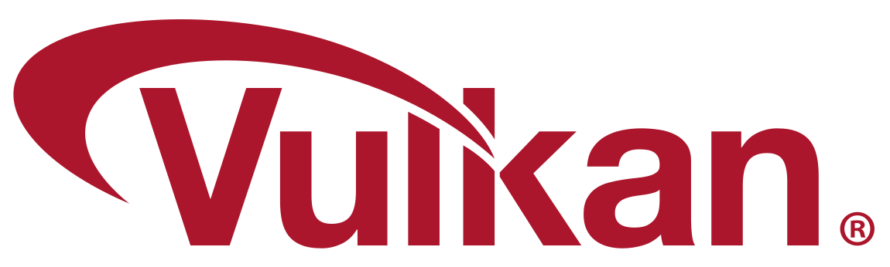
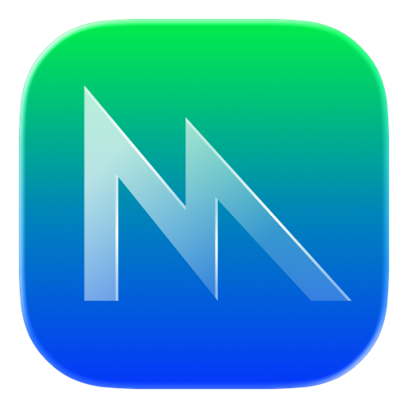

# Theseus

[](https://github.com/MrMilenko/Theseus/actions/workflows/build.yml)
[](LICENSE)
[](#)

<p align="center">
  
  &nbsp;&nbsp;&nbsp;&nbsp;
  
</p>

Six years of reverse engineering the original Xbox dashboard. This repo is the result.

Theseus boots on modded Xbox hardware as a drop in replacement for the stock dashboard. The same engine compiles natively on macOS, Linux, and Windows, where it doubles as **UIX Desktop**: a 3D launcher and media center. The desktop build renders through [bgfx](https://github.com/bkaradzic/bgfx): Metal on macOS, Vulkan on Linux and Windows.

The split is intentional. The Xbox build stays faithful to what you'd expect from the Xbox dashboard (or UIX Lite, if you've used a custom dashboard before). Everything that doesn't belong on an Xbox (Steam libraries, modern video playback, emulator-hosted ISOs, playlists, skin authoring tools) lives on the desktop side instead. Two projects, one engine.

<p align="center">
  
  
</p>
<p align="center">
  
  
</p>
<p align="center">
  
  
</p>

## On Xbox

A drop-in replacement for the stock Xbox dashboard on modded consoles. Same look and behavior, because that's what it is. Rebuilt plank by plank and still going.

What works:
- Every original scene, animation, and skin slot
- UIX Lite skins drop in unchanged. Skin authors don't have to do anything
- Hot swap skins from settings, no reboot
- ISO / CCI launching from the harddrive menu, plus the original XBE flow
- Hundreds of titles scan in milliseconds
- Title icons auto populate from each game's XBE certificate
- Quick overlay (LT + B) for ISO loader, file manager, FTP / drive widgets
- FTP server, recovery / panic screen, MP3 soundtrack playback

[Download for Xbox ->](https://github.com/MrMilenko/Theseus/releases) (or build from source, see below)

## On the desktop (UIX Desktop)

UIX Desktop is the Theseus engine compiled for your computer, with the modern features bolted on. macOS, Linux, Windows, Steam Deck friendly.

- **3D launcher** for native PC games, Steam libraries, RetroArch ROMs, and Xbox ISOs via [xemu](https://xemu.app)
- **Media library** that scans your Movies and TV folders, pulls posters from [TMDB](https://www.themoviedb.org/), plays back through libmpv
- **Skin editor** with live XAP scripting and a scene inspector. Change a skin, see it instantly
- **Title Maker** for adding games and apps, with per launcher import flows for Steam and RetroArch
- **Xbox HDD browser** that opens qcow2 and FATX images
- **CRT post process** for the old TV look. Scanlines, curvature, phosphor, bloom, all tunable
- **Graphics knobs** in Settings -> Display: vsync mode, FPS cap, MSAA, hardware video decode
- **Controllers**: Xbox and PlayStation pads via SDL2

[Download for desktop ->](https://github.com/MrMilenko/Theseus/releases)

## Quick Start

### Xbox

1. Grab the latest Xbox release (`default.xbe` + `uixdata/`)
2. Drop the XBE somewhere on the Xbox HDD, e.g. `E:\Dashboards\Theseus\default.xbe`
3. Copy `uixdata/` next to it
4. Copy `Configs/` to `C:\UIX Configs\`
5. Boot it. If something's missing, the panic screen tells you what.

### Desktop

1. Grab the release for your OS
2. Run it. That's it.

The Windows release ships with the DLLs it needs. macOS and Linux dynamically link to system libraries, so you'll want these installed:

**macOS (Homebrew):**
```
brew install sdl2 sdl2_mixer mpv curl
```

**Linux (Debian / Ubuntu):**
```
sudo apt install libsdl2-2.0-0 libsdl2-mixer-2.0-0 libmpv2 libcurl4
```

(Some distros ship `libmpv1` instead of `libmpv2`. Either works.)

If you'd rather build from source, jump down to [Building](#building).

## Adding games

Title Maker (F3 from the dashboard) is where you connect games to dashboard tiles. Three tabs:

**Main** is the catch all. Every title you've added shows up here, regardless of which tab created it. This is also where you add the weird stuff that doesn't belong to a launcher: a Windows .exe, a .bat script, a macOS .command file, a shell one liner, anything that takes a path or command. Edit names, swap icons, tweak the launch line. Most of your time managing the library happens here.

**Steam** auto detects your Steam install (Find button), or you point at it once. Hit Import Steam Library and your installed games come in with icons fetched from Valve's CDN. There's also a manual "Add by App ID" form for launching betas, demos, or games not in your normal library scan.

**RetroArch** detects your RetroArch install the same way. Import Recent Titles pulls in everything you've recently played in RetroArch, with the right core auto resolved and boxart copied from RetroArch's thumbnail packs. You can also add manually: pick a ROM, pick a core from the dropdown, done.

If you don't use Steam or RetroArch, you can turn either tab off under Optional Tabs (top of Main). Anything you've already added stays in Main either way.

## Customization

**Skins.** Drop them into `Data/Skins/` (Xbox: `uixdata\Skins\`) and pick from settings. UIX Lite community skins work as is, no conversion needed. Hot swap, no reboot.

**Scene authoring** (for the people building dashboards from scratch). Scenes are XAP scripts packed into `.xip` archives. The desktop build has a live XAP editor (F2), scene inspector (F1), and asset reload so you can tweak and see results immediately. The XAP node interface is the contract; the C++ behind it can change but the node API is treated as sacred. Full reference in [`docs/xap-contract.md`](docs/xap-contract.md).

## Controls (desktop)

**Dashboard:**

| Key | Xbox button | Action |
|---|---|---|
| Arrow keys | D-pad | Navigate |
| Enter / Space | A | Select |
| Backspace | B | Back |
| X / Y | X / Y | Context actions |
| Tab | White | Play / Pause |
| ` (backtick) | Black | Stop |
| WASD | Left stick | Analog navigation |

**Media playback:**

| Key | Action |
|---|---|
| Esc / Q | Stop, return to dashboard |
| Space | Pause / Resume |
| Left / Right | Seek 5s |
| `[` / `]` | Previous / Next in playlist |
| T | Track picker (audio + subtitles) |

**Tools (desktop only):**

| Key | Action |
|---|---|
| F1 | Scene inspector |
| F2 | XAP script editor |
| F3 | Title Maker |
| F4 | Settings |
| F5 | Xbox HDD browser |
| F6 | Playlist Maker |
| F10 | Toggle menu bar |
| F11 | Toggle fullscreen |
| Ctrl+M | Mute |
| Ctrl+R | Restart dashboard |

Xbox and PlayStation controllers also work via SDL2 GameController.

---

# For developers

The rest is build instructions, architecture notes, and the lineage. Skip if you just want to run it.

## Building

Both builds live in this repo and use the same Makefile.

### Xbox

Cross-compiles from macOS or Linux using clang + lld-link + cxbe. Requires:
- clang and lld-link (`brew install llvm` on macOS, `apt install clang lld` on Linux)
- [OXDK](https://github.com/MrMilenko/OXDK) cloned and built
- An Xbox SDK source tree (path passed as `XDK_BASE`)

```
git clone https://github.com/MrMilenko/OXDK ~/OXDK
cd ~/OXDK/tools/cxbe && make
cd /path/to/Theseus/build
make CONFIG=retail XDK_BASE=/path/to/xbox
```

Output lands at `~/builds/theseus/xbox-retail/default.xbe`.

### Desktop

Same source tree, different Makefile target. Needs C++17, SDL2, SDL2_mixer, libmpv, libcurl. Rendering goes through bgfx: Metal on macOS, Vulkan on Linux and Windows. bgfx ships as a git submodule and the shaders compile from .sc source via `shaderc`.

Init the submodules once before the first build:

```
git submodule update --init --recursive
```

Then build the bgfx libraries (one time per platform) and compile shaders:

```
# macOS (Apple Silicon)
make -C theseus/third-party/bgfx -j osx-arm64
make -C build shaders-bgfx

# Linux
make -C theseus/third-party/bgfx -j linux-release64
make -C build shaders-bgfx-spirv

# Windows (built from a MSYS2 mingw shell, or cross-compiled from Linux)
make -C theseus/third-party/bgfx -j mingw-gcc-release64
make -C build shaders-bgfx-spirv
```

After that, the per-OS build commands:

**macOS:**
```
brew install sdl2 sdl2_mixer mpv curl pkg-config
cd build && make desktop BGFX=1
~/builds/theseus/desktop/theseus
```

**Linux:**
```
sudo apt install build-essential pkg-config libsdl2-dev libsdl2-mixer-dev \
                 libvulkan-dev libx11-dev libmpv-dev libcurl4-openssl-dev
cd build && make desktop BGFX=1
~/builds/theseus/desktop/theseus
```

**Windows (MSYS2 / MinGW64):**
```
pacman -S make pkg-config mingw-w64-x86_64-gcc \
          mingw-w64-x86_64-SDL2 mingw-w64-x86_64-SDL2_mixer \
          mingw-w64-x86_64-mpv mingw-w64-x86_64-curl \
          mingw-w64-x86_64-vulkan-headers mingw-w64-x86_64-vulkan-loader
cd build && make desktop-win64 BGFX=1
```

Cross-compiling for Windows from macOS / Linux, ARM64 Linux, or any of the more involved setups is in [`docs/desktop/`](docs/desktop/). The CI workflow runs all the build matrix combinations on every push, which is the closest thing to executable docs for the one-time setup.

The legacy OpenGL backend still compiles by dropping the `BGFX=1` flag, useful for older hardware without Vulkan support. Shipped releases use the bgfx path.

## How it works

The engine is approximately 50 source files reconstructed from the retail and patched XBE's spanning 4920 to 5960, organized the same way the original dashboard was: script VM, scene graph, rendering, asset loading, UI framework, system integration, and launcher. Per-subsystem reverse engineering notes are in [`docs/decomp/`](docs/decomp/).

The XAP scripting layer is a custom JS-like bytecode VM. The scene graph is VRML97-inspired with runtime reflection via FND/PRD property tables. On the desktop side, D3D8 calls translate through a thin shim into bgfx, which targets Metal on macOS and Vulkan on Linux and Windows. Everything else compiles for both targets from the same shared source.

If you're poking around the source, the high-level layout:

```
theseus/
  engine/      Pure logic (VM, nodes, math)
  shared/      Cross-platform with Win32 types (file I/O, audio, settings)
  render/      Scene graph, materials, shapes
  xbox/        Xbox-only (XTL, modchip, kernel APIs)
  desktop/     Desktop-only (SDL, bgfx, ImGui tools)
  toolbox/     PrometheOS-derived FTP / drive / network (Xbox-only)
theseuslib/    Shared C library (xiso parser, xip parser)
```

Heavier docs index lives at [`docs/README.md`](docs/README.md).

## Heritage

Theseus is part of the TeamUIX lineage. JbOnE created *User.Interface.X* (UIX), a source level modification of the original Xbox Dashboard, which we also poked around in via Ghidra to figure certain things out. Modern TeamUIX continues that tradition with [UIX Lite](https://github.com/OfficialTeamUIX/UIX-Lite) (a heavily patched retail XBE) and Theseus (this repository).

There's a circularity to it. UIX modified the dashboard at the source level. Theseus reaches the same destination from the other side of the river, rebuilding the codebase from binary analysis and untangling changes made to XIPs over 25 years of community modification.

For the broader UIX project narrative, see [UIX History](https://github.com/MrMilenko/UIX-History).

## Credits

**Team UIX:**
- **Milenko**: primary RE and development, UIX Desktop port
- **BigJx**: UIX Lite XIPs (XAP scripts, skins, scene assets), testing, bug reports
- **Rocky5**: skin presets and the Colourizer XBE color patcher (technique descends from **ZogoChieftan**'s in-dashboard color patching in BlackStormX, circa 2004)
- **JbOnE**: original UIX, the lineage Theseus continues

**Related projects:**
- [Team Resurgent](https://github.com/Team-Resurgent): [PrometheOS](https://github.com/Team-Resurgent/PrometheOS-Firmware) (the toolbox is forked from here via [UIX Lite Toolbox](https://github.com/OfficialTeamUIX/UIX-Lite-Toolbox)) and [Hermes](https://github.com/Team-Resurgent/Hermes) (ISO/CCI mount support)
- [xemu](https://xemu.app): Original Xbox emulator that the desktop launcher integrates with for ISO playback

## Third-party libraries

Xbox build:

| Library | License | Purpose |
|---|---|---|
| [minimp3](https://github.com/lieff/minimp3) | CC0 | MP3 decoder for the music system |

Desktop build:

| Library | License | Purpose |
|---|---|---|
| [SDL2](https://www.libsdl.org/) | zlib | Window, input, audio |
| [SDL2_mixer](https://github.com/libsdl-org/SDL_mixer) | zlib | Sound playback |
| [libmpv](https://mpv.io/) | LGPL 2.1+ | Video playback |
| [libcurl](https://curl.se/libcurl/) | curl | HTTPS for TMDB metadata |
| [Dear ImGui](https://github.com/ocornut/imgui) | MIT | Developer tool UI |
| [ImGuiColorTextEdit](https://github.com/BalazsJako/ImGuiColorTextEdit) | MIT | XAP script editor with syntax highlighting |
| [stb_image](https://github.com/nothings/stb) | Public Domain | Image loading |
| [bgfx](https://github.com/bkaradzic/bgfx) | BSD 2-Clause | Cross-platform render abstraction (Metal, Vulkan) |
| [bx](https://github.com/bkaradzic/bx) | BSD 2-Clause | bgfx base library |
| [bimg](https://github.com/bkaradzic/bimg) | BSD 2-Clause | bgfx image utility library |
| [GLEW](https://glew.sourceforge.net/) | Modified BSD / MIT | OpenGL extension loader (legacy GL backend, Windows only) |

Full catalog with attributions is in [`LICENSE-THIRD-PARTY.md`](LICENSE-THIRD-PARTY.md).

## License

Theseus is licensed under the **GNU General Public License, version 3 or later** (`GPL-3.0-or-later`). Full license text in [`LICENSE`](LICENSE).

Inherited code keeps its origin license intact (`theseus/toolbox/` from PrometheOS via UIX Lite Toolbox is GPL-3.0; Hermes is GPL-3.0). The XIPs and skin assets shipped in `Data/` are TeamUIX's UIX Lite work and ship under GPL-3.0-or-later.
